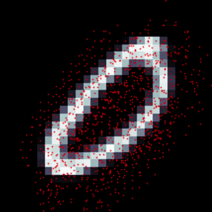

## caffe implementation of Deformable Convolutional Networks
 * By unsky
 * Thanks to office code: https://github.com/msracver/Deformable-ConvNets

 ## Usage
 ### Use my  modified caffe 
The MNIST example is in caffe/defor/ 
```
./train_lenet.sh

```
and the model is in model_protxt

### Use the code in your caffe
All codes is in deformable_conv_cxx/

#### 1. Add to layer definition to caffe.proto:

```
  optional DeformableConvolutionParameter deformable_convolution_param = 999;

```
and
```
message DeformableConvolutionParameter {
  optional uint32 num_output = 1; 
  optional bool bias_term = 2 [default = true]; 
  repeated uint32 pad = 3; // The padding size; defaults to 0
  repeated uint32 kernel_size = 4; // The kernel size
  repeated uint32 stride = 6; // The stride; defaults to 1
  repeated uint32 dilation = 18; // The dilation; defaults to 1
  optional uint32 pad_h = 9 [default = 0]; // The padding height (2D only)
  optional uint32 pad_w = 10 [default = 0]; // The padding width (2D only)
  optional uint32 kernel_h = 11; // The kernel height (2D only)
  optional uint32 kernel_w = 12; // The kernel width (2D only)
  optional uint32 stride_h = 13; // The stride height (2D only)
  optional uint32 stride_w = 14; // The stride width (2D only)
  optional uint32 group = 5 [default = 4]; // The group size for group conv
  optional FillerParameter weight_filler = 7; // The filler for the weight
  optional FillerParameter bias_filler = 8; // The filler for the bias
  enum Engine {
    DEFAULT = 0;
    CAFFE = 1;
    CUDNN = 2;
  }
  optional Engine engine = 15 [default = DEFAULT];
  optional int32 axis = 16 [default = 1];
  optional bool force_nd_im2col = 17 [default = false];
}
```
you can read the template in deformable_conv_cxx/caffe.proto

#### 2.Move codes to  your caffe
```
move deformable_conv_layer.cpp and deformable_conv_layer.cu to yourcaffepath/src\caffe\layers\

move deformable_conv_layer.hpp to yourcaffepath/include\caffe\layers\

move deformable_conv_layer.hpp to yourcaffepath/include\caffe\layers\

move deformable_im2col.cu to yourcaffepath\src\caffe\util\

move deformable_im2col.hpp to yourcaffepath\include\caffe\util\
```
#### Compile in your caffe root path
```
mkdir build
cd build
cmake ..
make  all
```


## Result

| Test Accuracy | Regular CNN | Deformable CNN |
| --- | --- | --- |
| Regular MNIST | 98.74% | 98.53% |


The following animation is generated by Felix Lau (with his tensorflow implementation):https://github.com/felixlaumon/deform-conv/



### TODO List

 - [x] all tests passed
 - [x] evaluate performance on Regular MNIST
 - [ ] evaluate  object detection  performance on voc


 ## Deformable Convolutional Networks
> Dai, Jifeng, Haozhi Qi, Yuwen Xiong, Yi Li, Guodong Zhang, Han Hu, and Yichen
Wei. 2017. “Deformable Convolutional Networks.” arXiv [cs.CV]. arXiv.
http://arxiv.org/abs/1703.06211